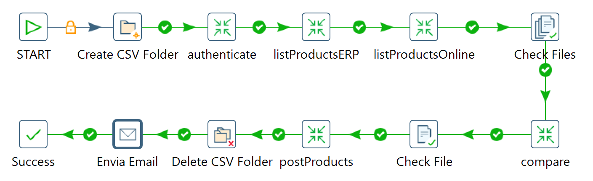
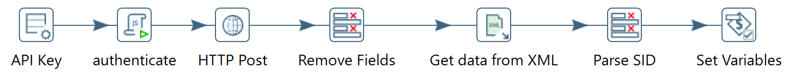
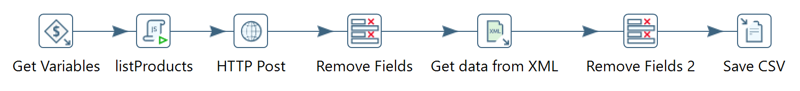
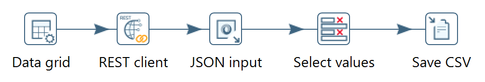
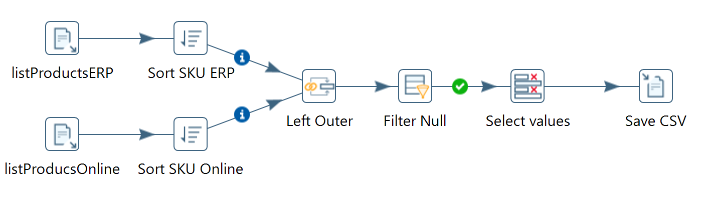
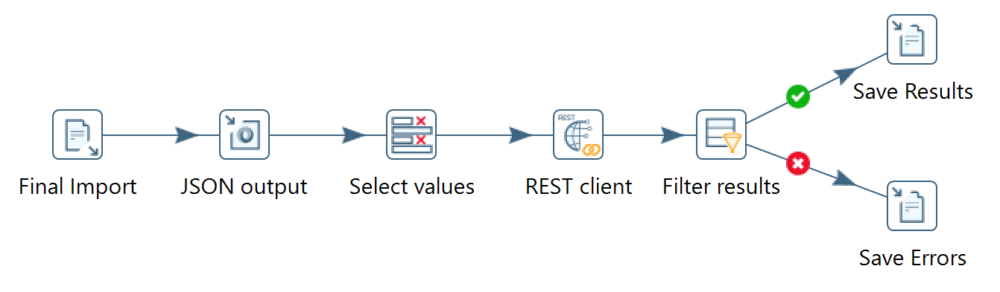

# trabalhoISI_6160 - LESI - IPCA

Projeto desenvolvido para a disciplina de Integração de Sistemas de Informação.

Esta disciplina faz parte do terceiro ano curricular da Licenciatura em Engenharia de Sistemas Informáticos.

## Contextualização do Trabalho

A execução deste trabalho, pretende-se focar a aplicação e experimentação de ferramentas em processos de ETL (Extract, Transformation and Load), inerentes a processos de Integração de Sistemas de informação ao nível dos dados.

Será necessário para a execução deste trabalho, criar um processo de ETL, que retire informação de um ERP e carregue num e-commerce online.

### Objetivos

Os objetivos do desenvolvimento deste trabalho são os seguintes:

- Consolidar conceitos associados à Integração de Sistemas de Informação usando Dados;
- Analisar e especificar cenários de aplicação de processos de ETL;
- Explorar ferramentas de suporte a processos de ETL;
- Explorar novas Tecnologias, Frameworks ou Paradigmas;
- Potenciar a experiência no desenvolvimento de software;
- Facilitar a assimilação do conteúdo da Unidade Curricular.

## Job

O Job agrega todas as transformações existentes no processo, assim como alguns passos a nível do Job.

## Transformações

São utilizadas estas transformações ao longo do Job.

### Authenticate

Este step procede à autenticação no webservice SOAP do programa de faturação.

### listProductsERP

gravado num CSV os resultados.

### listProductsOnline

De seguida, é feito um pedido GET ao webservice REST da loja online, e os resultados são gravados num CSV.

### Compare

Neste step é feita uma comparação entre os dois CSV’s criados a partir dos produtos presentes tanto no programa de faturação, como online e grava os resultados num novo ficheiro.

### postProducts

Após a verificação é feito um pedido POST ao webservice REST da loja online, onde são criados os produtos, gravando os resultados num ficheiro.

